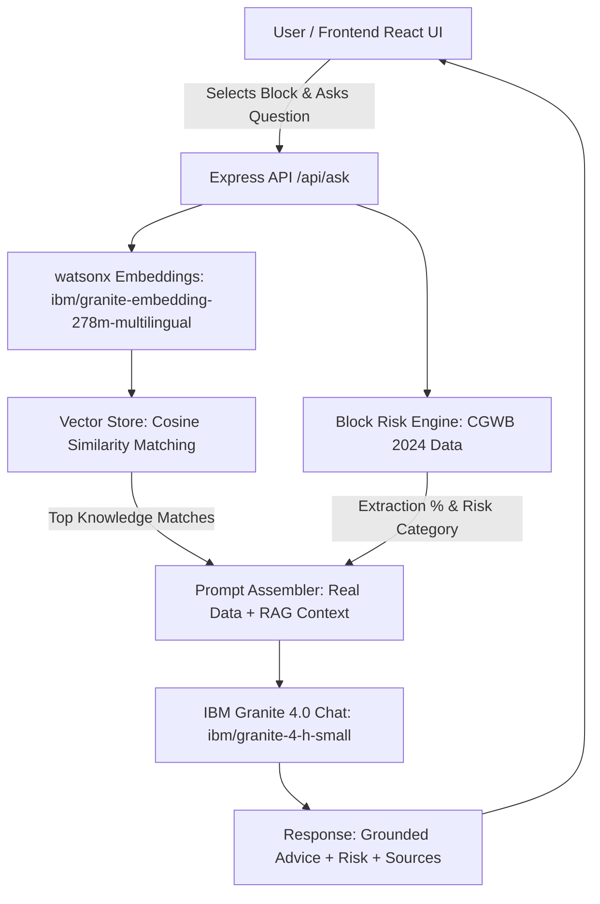

# 🌊 Undercurrent

> **An AI-powered groundwater depletion early-warning advisor for Odisha, India.**

[](#-live-demo--preview)
[](https://www.ibm.com/watsonx)
[](https://cgwb.gov.in)
[](https://sdgs.un.org)

---

## 🎯 The Problem Being Solved

In Odisha, over **80% of annual rainfall (1,419 mm)** arrives within a short 90-day monsoon window. Due to rapid urban concretization and sloped terrain, water rushes off into the Bay of Bengal before replenishing subterranean aquifers. 

- **Urban & Industrial Hotspots:** Nine administrative blocks (including parts of **Bhubaneswar**, **Nayagarh**, and **Talcher**) have exceeded **70% extraction**, entering the **Semi-Critical** risk zone.
- **Coastal Salinity:** Over-pumping in coastal blocks like **Ersama** and **Mahakalpada** pulls seawater into fresh aquifers.
- **Sustainable Development Goals (SDGs):**
  - **SDG 6 (Clean Water and Sanitation):** Target 6.4 (sustainable withdrawals and addressing water scarcity) and 6.6 (protecting water-related ecosystems).
  - **SDG 15 (Life on Land):** Halting soil erosion, land degradation, and desertification.

Most individuals, farmers, and planners only discover the crisis when their borewell runs dry. **Undercurrent** bridges official government hydrogeological data and generative AI to provide localized early warnings and grounded artificial recharge guidance.

---

## 🛠️ Tech Stack

- **Frontend:** React 19, Vite, Tailwind CSS, Leaflet + OpenStreetMap (`react-leaflet`).
- **Backend:** Node.js, Express, CORS, Dotenv.
- **AI & Embedding Models:** 
  - `ibm/granite-4-h-small` (Generative chat & reasoning via IBM watsonx.ai).
  - `ibm/granite-embedding-278m-multilingual` (High-dimensional vector embeddings).
- **Retrieval-Augmented Generation (RAG):** Custom vector store with cosine similarity retrieval across localized hydrogeological manuals.
- **Real-Time Weather:** Open-Meteo API integration for live block-level temperature and precipitation forecasts.

---

## 📊 Data Sources & Citations

- **Central Ground Water Board (CGWB), Department of Water Resources, Ministry of Jal Shakti, Government of India:**
  - *Dynamic Ground Water Resources of Odisha, 2024* (Annexure-XII, Block-wise Assessment).
  - *Ground Water Year Book, South Eastern Region (SER), Bhubaneswar*.
- **National Water Informatics Centre (India-WRIS):** Gridded regional rainfall baselines.

---

## 🏛️ Architecture Overview

Undercurrent employs a decoupled client-server architecture with an integrated vector search pipeline. When a user asks a question about an Odisha block, the backend looks up its official CGWB status (e.g. Semi-Critical, Saline, or Safe), embeds the question, performs cosine similarity retrieval over engineering manuals, and injects both the real data and retrieved context into IBM Granite to produce a grounded, transparent advisory.



---

## 🚀 Setup & Local Installation

### Prerequisites
- Node.js (v18 or higher)
- npm
- An IBM Cloud / watsonx.ai API Key and Project ID

### 1. Backend Setup

```bash
cd server
npm install
```

Create a `.env` file in `/server` based on your credentials:
```env
PORT=5000
IBM_WATSONX_APIKEY=your_ibm_watsonx_api_key
IBM_PROJECT_ID=your_ibm_project_id
IBM_REGION_URL=https://eu-de.ml.cloud.ibm.com
```

Build the local vector store:
```bash
node build-vector-store.js
```

Start the backend server:
```bash
node server.js
# Runs on http://localhost:5000
```

### 2. Frontend Setup

```bash
cd ../client
npm install
```

Create a `.env` file in `/client`:
```env
VITE_API_URL=http://localhost:5000
```

Start the Vite development server:
```bash
npm run dev
# Runs on http://localhost:5173
```

---

## 🌐 Live Demo & Preview

- **Live Frontend (Vercel):** *[Insert your Vercel deployment link here]*
- **Live Backend (Render):** *[Insert your Render backend service link here]*

### Preview Screenshot / GIF
> *[Insert project screenshot or GIF here]*

---

## 🛡️ Responsible AI Considerations

- **Transparency & Source Attribution:** Every response generated by IBM Granite explicitly cites the specific reference documents used (e.g., `percolation-pits.txt`, `check-dams.txt`, `contour-trenches.txt`).
- **Fairness & Geographic Representation:** Combines coastal saline realities (Jagatsinghpur/Kendrapara), urban over-extraction (Khurda/Bhubaneswar), and western hard-rock drought zones (Nuapada/Balangir) without regional bias.
- **Resource Efficiency:** Fast-path regex short-circuit for simple greetings eliminates unnecessary LLM calls, saving compute and token usage.
- **Disclaimer:**
  > ⚠️ *The evaluations and recommendations provided by Undercurrent are based on regional trend data published by the Central Ground Water Board (CGWB) and generative AI synthesis. They are intended for educational and early-warning decision support, and are not a substitute for an on-site professional hydrogeological or geophysical survey.*
